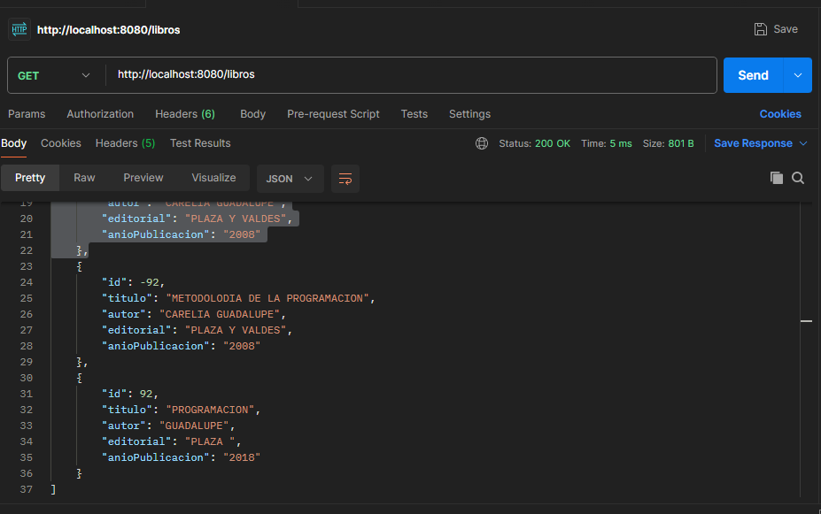

## Web Api de Libro

Interfaz de programación de aplicaciones web, es esencialmente un mensajero entre aplicaciones. Permite que diferentes programas de software se comuniquen entre sí proporcionando un conjunto de reglas y especificaciones. Aquí se presentara la segunda interfaz de practica del tercer semestre de la universidad de guayaquil.

## Inicialización del proyecto
Utiliza Spring Initializr para generar un nuevo proyecto Spring Boot con las siguientes dependencias: Web.

## Spring Initializr

## Clase Libro 
En la clase Libro consta de  5 atributos : Id,titulo, autor, editorial y año de publicación.
Con su respectivo constructor.
Y los getters y setters.
## Package com.tuuniversidad.controllers
### LibroController
En esta clase consta de anotaciones Spring
@RestController para indicar que devuelven JSON directamente en lugar de vistas. 

Se utilizan anotaciones como @GetMapping, @PostMapping para mapear métodos a solicitudes HTTP específicas (GET y POST, respectivamente).

GET /libros: Retorna una lista de todos los libros.

GET /libros/{id_libro}: Retorna un libro por el id.

POST /libros: crea un nuevo recurso libro

## Package com.tuuniversidad.repository
### LibroRepository
Es una interface
Donde se encuentran los siguientes métodos :

	    Libro getLibro(Long id);
            List<Libro> getLibros();
	    Libro nuevoLibro(Libro libro);
### LibroRepositoryImp
Es una clase donde se realiza implementaciones de repositorios personalizados: los desarrolladores pueden crear repositorios personalizados adaptados a necesidades específicas de acceso a datos.
    
    public LibroRepositoryImp() {
		libros.add(new Libro(978-270-800L,"METODOLODIA DE LA PROGRAMACION","CARELIA GUADALUPE","PLAZA Y VALDES","2008"));
		libros.add(new Libro(978-843-6954-302L,"PROGRAMACION WEB EN JAVA","JOSE MIGUEL ORDAX","EDUCACION.ES","2013"));
		libros.add(new Libro(978-844-8173-937L,"METODOLODIA DE LA PROGRAMACION","CARELIA GUADALUPE","PLAZA Y VALDES","2008"));	
	}    
## Package com.tuuniversidad.service 
### LibroService
Es una interface.
La @Serviceanotación marca la clase como un componente de servicio.
Se agregan los metodos:

	Libro getLibro(Long id);
	List<Libro> getLibros();
	Libro nuevoLibro(Libro libro);
### LibroServiceImp
La LibroRepositoryImp se inyecta utilizando Spring Autowired.
La clase Service típicamente contiene métodos que exponen la funcionalidad del servicio al mundo exterior.

       private LibroRepository libroRepository;
		
	

	@Override
	public Libro getLibro(Long id) {
		return libroRepository.getLibro(id);
	}

	@Override
	public List<Libro> getLibros() {
		return libroRepository.getLibros();
	}

	@Override
	public Libro nuevoLibro(Libro libro) {
		return libroRepository.nuevoLibro(libro);
	}
 ## Prueba en Postman
 Postman proporciona herramientas para crear y organizar sus interacciones API en colecciones reutilizables. Puede encadenar solicitudes, administrar entornos con diferentes configuraciones de API y escribir pruebas para garantizar que su API se comporte como se espera.
 
	
